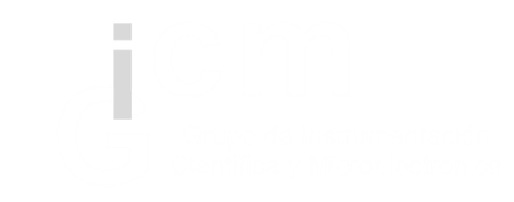

<table width="100%">
<tr>
<td align="left" valign="middle">

<b>Workshop PyCon Colombia 2026</b> 
<i>hls4ml: De modelos de Python a aceleración hardware</i>

</td>

<td align="right" valign="middle">

&nbsp;&nbsp;

</td>
</tr>
</table>

---

Material del workshop para la implementación de modelos de Machine Learning en FPGA utilizando **hls4ml**.

Durante el taller se aborda la optimización de redes neuronales mediante técnicas de **poda (pruning)** y **cuantización (quantization)** para lograr inferencia hardware de baja latencia.

## Documentación del Workshop

Consulta la documentación completa, guías y material complementario en la [Wiki del proyecto](https://github.com/GICM-UdeA/hls4ml_workshop/wiki).

---

## Speakers

Este workshop es diseñado y presentado por:

**Natalia Echeverri Durán** | *Grupo de Instrumentación Científica y Microelectrónica*

*  

**Jerónimo López Gómez** | *Grupo de Instrumentación Científica y Microelectrónica*

*  

 

---

   
  <b>Grupo de Instrumentación Científica y Microelectrónica | Universidad de Antioquia</b>

---

## 📜 Licencia

Este proyecto está licenciado bajo la licencia MIT. Consulte el archivo [LICENSE](LICENSE) para más información.

El material puede ser utilizado y adaptado, siempre que se otorgue el crédito correspondiente a sus autores.
